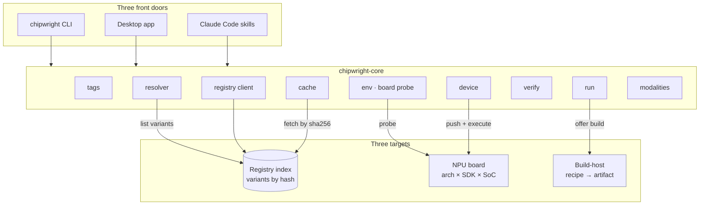

# Architecture

Chipwright is built as **three front doors over one core, reaching three targets**. The shape is deliberate: every surface a user touches is thin, all the judgement lives in one place, and that one place talks to exactly three things in the outside world.

## Three front doors

A developer meets Chipwright through whichever door fits their workflow. None of them hold logic of their own — each translates a request into a `chipwright-core` call and renders the result.

- **CLI** — `chipwright doctor · resolve · run`. The reference surface, and the one used in CI.
- **Desktop app** — a graphical surface over the same core, for browsing the registry and driving a board without the terminal.
- **Claude Code skills** — the core's verbs exposed to an agent, so "resolve this model for my board and verify it" is a tool call.

Because the doors are thin, they can't drift from each other. A behavior change happens once, in the core, and all three doors inherit it.

## One core

`chipwright-core` is where resolution, verification, and device I/O actually happen. It owns the contract — the tag grammar, the four resolve outcomes, the verification record — and nothing above it reimplements that contract.

## Three targets

The core reaches out to exactly three things:

- **Registry** — the index of verified variants. A git-repo file, read and cached; artifacts live by hash in object storage. Reviewable in pull requests, which is what makes a verification record trustworthy.
- **Board** — the physical NPU. The core probes it for its target key (arch × SDK × SoC) and pushes + executes artifacts on it over SSH.
- **Build-host** — where an artifact is produced from a recipe when no hosted variant matches the chip. *(The `build` verb — next milestone.)*

## Diagram

## Module map

The core is a handful of small modules, each owning one job. Read them in roughly the order a `run` flows through them.

| Module | Responsibility |
| --- | --- |
| `tags` | The wheel-tag grammar for NPU artifacts — parse and format `name-version+qnnSDK-htpARCH-QUANT-SHAPE.ext`. Parsing is strict: a tag that doesn't parse is a bug, not a near-miss. |
| `env` | Probe the board over SSH/ADB into a **TargetKey** — the Hexagon arch, QAIRT version, and SoC the resolver matches against. Offline is a first-class state: you can name a target by hand. |
| `resolver` | Match a model's registry variants to a TargetKey and return one of four outcomes — USE / USE-with-warning / BUILD / FAIL(axis). The arch axis is hard; the SDK axis is a range. |
| `registry` | Read the index (a cached git-repo YAML file) and list a model's variants. No server to run; the whole index is reviewable in a pull request. |
| `cache` | Content-addressed artifact cache at `~/.cache/chipwright`. Addressed by sha256, verified on fetch and on read — a truncated download is caught here, not at load on the board. |
| `device` | The remote QNN runner. Push a context binary to the board and execute it over SSH. Quantization-agnostic: it moves raw bytes in the graph's native dtype. |
| `verify` | The NPU-vs-CPU cosine — the check that catches a fast wrong answer. A high cosine is necessary, not sufficient, so it stays separate from the task metric. |
| `run` | The `run` verb. Ties the resolver, the device transport, and a modality runner together, and ends in the verification cosine. |
| `cli` | The `chipwright` command surface — `doctor`, `resolve`, `run` — rendering core decisions for a human. |
| `modalities` | Per-task glue (frontend, decoders, CPU reference) a `chipwright-<modality>` package owns. The core calls each through a uniform `run(device, …)`. First runner: ASR. |

## Why this shape

The core's value is a single, honest decision about whether an artifact will run correctly on a specific chip. Centralizing that in one place — not in a CLI, not in an app, not in a skill — is what lets every surface give the same answer, and what lets the verification record mean the same thing everywhere it appears.
